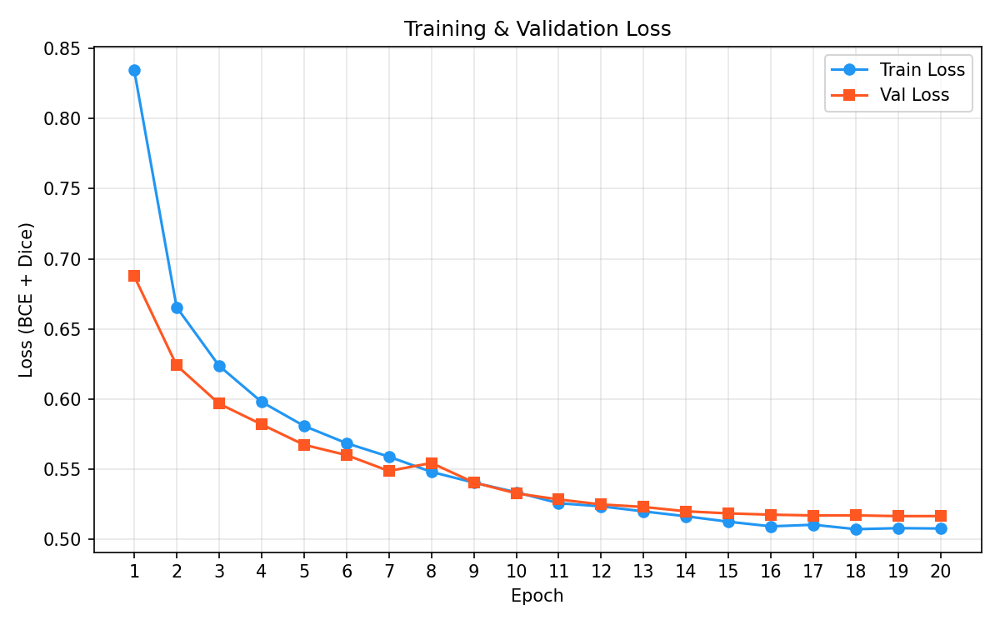
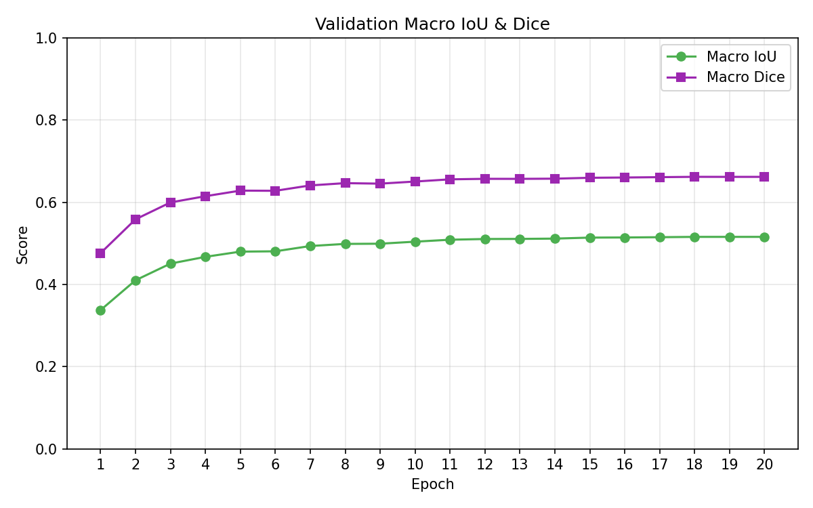
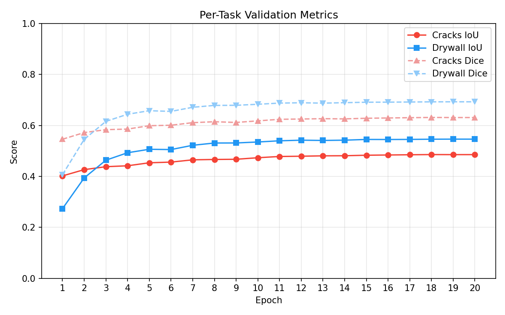
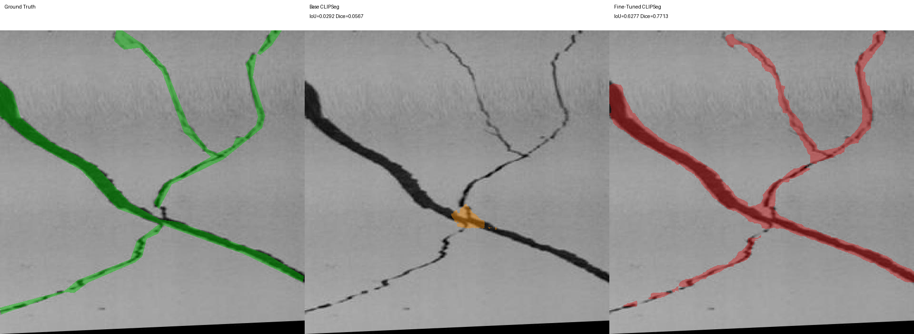
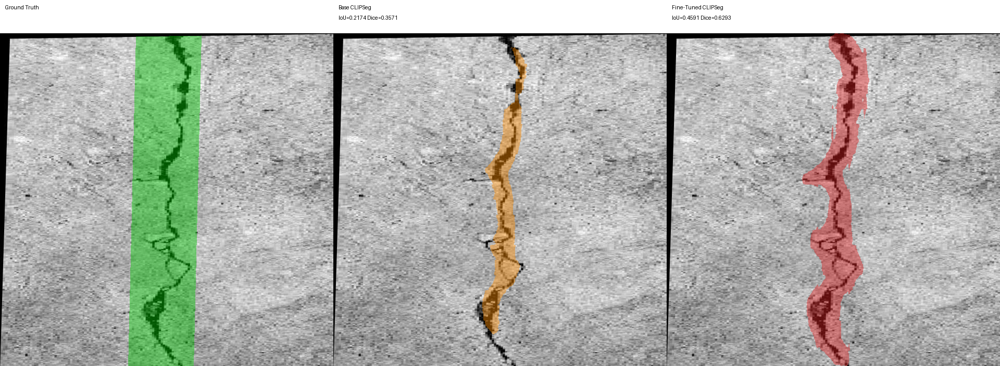
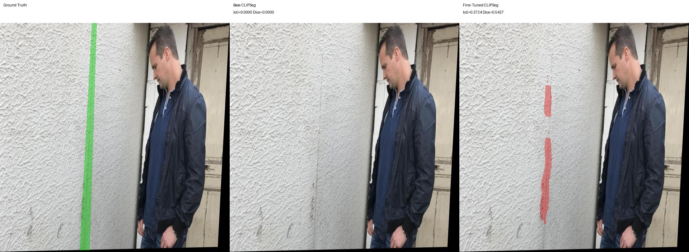
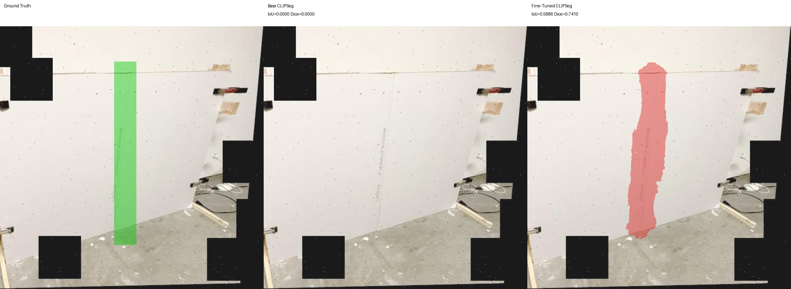
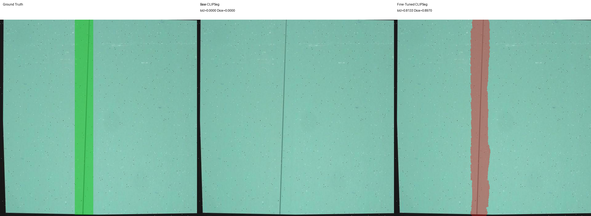
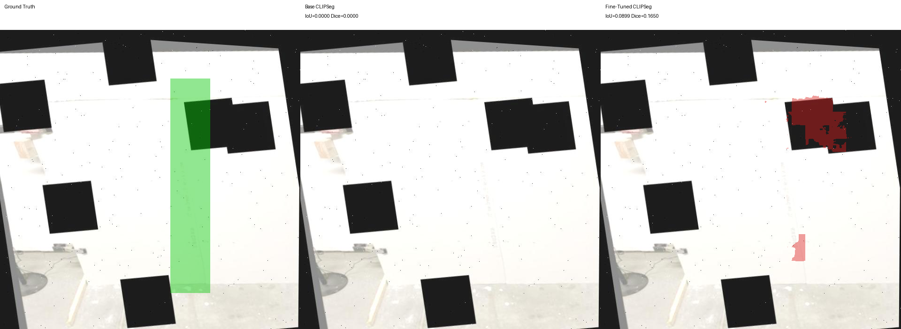

# Prompted Segmentation for Drywall QA

## Goal

Fine-tune a single text-conditioned segmentation model that, given an image and a natural-language prompt, produces a binary mask for:

- **"segment crack"** (cracks dataset)
- **"segment taping area"** (drywall-join dataset)

## Approach

**Model:** [CLIPSeg](https://huggingface.co/CIDAS/clipseg-rd64-refined) (`CIDAS/clipseg-rd64-refined`), a CLIP-based model with a lightweight decoder for text-prompted segmentation.

**Why CLIPSeg:** The assignment requires a text-conditioned interface (`image + prompt -> mask`). CLIPSeg is a natural (and relatively lightweight) choice, where one model handles both tasks via the prompt, with no task-specific heads or separate models needed.

**Fine-tuning strategy:**

- Freeze the CLIP text encoder entirely
- Freeze most of the CLIP vision encoder
- Unfreeze the last 2 vision encoder layers for domain adaptation
- Train the segmentation decoder
- This gives 15.7M trainable parameters out of 150.7M total (~10.4%)

**Training details:**

- **Loss:** Weighted BCE + Dice loss, with per-task positive-pixel weighting (cracks are sparse) and per-task sample weighting (drywall labels are weaker since they are just bounding boxes)
- **Augmentation:** Random horizontal flip (50%), vertical flip (20%), rotation +/-15 deg (30%), color jitter (brightness, contrast, saturation)
- **Prompt variants during training:** `"segment crack"`, `"segment wall crack"` for cracks; `"segment taping area"`, `"segment joint/tape"`, `"segment drywall seam"` for drywall. These are taken from the task pdf.
- **LR schedule:** Cosine decay with 5% linear warmup
- **Optimizer:** AdamW (lr=1e-4, weight_decay=1e-4)
- **AMP:** Enabled (fp16 on CUDA)
- **Gradient clipping:** max_norm=1.0
- **Early stopping:** patience=5 (did not trigger; ran full 20 epochs)
- **Post-training threshold search:** Per-task optimal threshold selected on validation set (cracks=0.60, drywall=0.45)
- **Seed:** 7

## Datasets

| | Cracks | Drywall-Join-Detect |
|---|---|---|
| Source | [Roboflow](https://universe.roboflow.com/fyp-ny1jt/cracks-3ii36) | [Roboflow](https://universe.roboflow.com/objectdetect-pu6rn/drywall-join-detect) |
| Images | 5,000 | 1,022 |
| Annotations | 7,930 | 1,424 |
| Image size | 640x640 | 640x640 |
| Mask type | Polygon segmentation (99.5%) | **Bounding box only** |
| Canonical prompt | `"segment crack"` | `"segment taping area"` |

**Note:** The drywall dataset provides only bounding boxes, not segmentation masks. The model trains on bbox-derived pseudo-masks for this task, not on more refined segmented masks. One option to get segmented masks is to run SAM on the bounding boxes, but this was not done primarily due to time constraints, but also because SAM would introduce at least some errors, which would lead to corruption of the ground truth.

## Data Splits

Splits are created deterministically (seed=7) with each dataset split separately to prevent the smaller drywall set from being drowned out.

| Split | Cracks | Drywall | Total |
|---|---|---|---|
| Train (70%) | 3,500 | 715 | 4,215 |
| Val (15%) | 750 | 153 | 903 |
| Test (15%) | 750 | 154 | 904 |

## Results

### Baseline vs Fine-Tuned (Test Set)

| Task | Model | IoU | Dice | IoU Gain |
|---|---|---|---|---|
| Cracks | Zero-shot CLIPSeg | 0.2288 | 0.3383 | — |
| Cracks | **Fine-tuned CLIPSeg** | **0.4898** | **0.6359** | **+0.2610** |
| Drywall | Zero-shot CLIPSeg | 0.0271 | 0.0384 | — |
| Drywall | **Fine-tuned CLIPSeg** | **0.5445** | **0.6924** | **+0.5174** |
| **Macro** | Zero-shot CLIPSeg | 0.1279 | 0.1883 | — |
| **Macro** | **Fine-tuned CLIPSeg** | **0.5171** | **0.6641** | **+0.3892** |

### Consistency (Test Set)

| Task | IoU Mean | IoU Std | IoU Min | Dice Mean | Dice Std | Dice Min |
|---|---|---|---|---|---|---|
| Cracks | 0.4898 | 0.1821 | 0.0100 | 0.6359 | 0.1785 | 0.0198 |
| Drywall | 0.5445 | 0.1428 | 0.0000 | 0.6924 | 0.1391 | 0.0000 |

- Drywall predictions are more consistent (lower std) despite training on weaker bbox labels.
- Cracks have higher variance, driven by thin/faint cracks that the model struggles with.
- Even though drywall had less examples and lesser quality masks, the model seems to perform better on it because the ground truth is easier to learn (rectangular bbox/straight lines instead of curved cracks) 
- A small number of images have near-zero scores

### Optimal Thresholds (from validation search)

| Task | Threshold |
|---|---|
| Cracks | 0.60 |
| Drywall | 0.45 |

These were found by sweeping 0.10–0.80 on the validation set and selecting the threshold that maximizes per-task IoU. Test evaluation uses these per-task thresholds.

## Training Curves

### Loss



### Macro IoU & Dice



### Per-Task Metrics



Training converges around epoch 15–16. The model trained for all 20 epochs (early stopping patience of 5 was not triggered). Best checkpoint selected by validation macro IoU.

## Visual Examples

### Crack Examples

| Example | Description |
|---|---|
|  | The finetuned model performs much better than the base model and is able to predict the complex geometry of this crack |
|  | Here, the finetuned model seems to perform much better than even the ground truth segmentation! The GT mask is just a bbox but the finetuned model produces a much finer mask |
|  | Here, the model seems to fail to perform well. It can be due to the complexity of the scene due to which the crack is not really the most noticeable |

### Drywall Examples
| Example | Description |
|---|---|
|  | We see that the finetuned model predicts a decent mask, where the base model didn't predict anything at all |
|  | Here also the finetuned model performs nicely. We can see that the mask shape is a bit irregular (in the previous example also) because the ground truth is a (relatively) big bounding box so it is not very precise in capturing just the drywall taping area |
|  | Here the finetuned model performs bad. It could be due to the complexity of the scene where we have a lot of random black boxes and also because the target area seems quite faint |

## Failure Analysis

- **Thin/faint ground truths:** CLIPSeg's decoder operates at reduced resolution (~352x352) and upsamples to 640x640. Very thin cracks or drywalls can be lost during this process, leading to near-zero IoU on some images.
- **Drywall zero-score images:** A few drywall test images produce completely empty predictions. These may be images where the joint is subtle or where the bbox pseudo-mask training signal was too weak. In some drywall examples, there are random black squares also. This can make the prediction more difficult.
- **Drywall label noise:** All drywall ground truth is derived from bounding boxes, which overestimate the true mask area. The reported IoU/Dice for drywall is measured against these box pseudo-masks, not against true segmentation masks.

## Runtime & Footprint

| Metric | Value |
|---|---|
| Total parameters | 150.7M |
| Trainable parameters | 15.7M (10.4%) |
| Model size (safetensors) | 576 MB |
| Training time | 2,341s (~39 min) |
| Training hardware | NVIDIA RTX 3050 Ti (4GB VRAM) |
| Avg inference time | 54.9 ms/image |
| Batch size (training) | 4 |
| Epochs trained | 20 |

## Prediction Masks

Prediction masks are saved as single-channel PNGs with pixel values {0, 255}, matching the source image spatial size (640x640). Filenames follow the format:

```
<image_id>__segment_crack.png
<image_id>__segment_taping_area.png
```

See `outputs/predictions/` for the full test set predictions.

## How to Reproduce

### Setup

```bash
python3 -m venv venv
source venv/bin/activate
pip install torch transformers pillow numpy matplotlib
```

### Train

```bash
python3 scripts/finetune_clipseg.py \
  --output-dir runs/clipseg_v2 \
  --epochs 20 \
  --batch-size 4 \
  --learning-rate 1e-4 \
  --unfreeze-vision-layers 2 \
  --early-stopping-patience 5 \
  --seed 7
```

### Inference (generate prediction masks)

```bash
python3 scripts/inference.py \
  --run-dir runs/clipseg_v2 \
  --output-dir outputs/predictions \
  --split test
```

### Compare baseline vs fine-tuned

```bash
python3 scripts/compare_clipseg_models.py \
  --run-dir runs/clipseg_v2 \
  --split test \
  --save-dir outputs/clipseg_v2_compare
```

### Plot training curves

```bash
python3 scripts/plot_training.py \
  --run-dir runs/clipseg_v2 \
  --output-dir figures
```

## Repository Layout

```
.
├── README.md
├── Prompted_Segmentation_for_Drywall_QA.pdf
├── scripts/
│   ├── finetune_clipseg.py          # Main training script
│   ├── inference.py                  # Prediction mask generation
│   ├── compare_clipseg_models.py     # Base vs fine-tuned comparison
│   ├── plot_training.py              # Training curve plots
│   ├── zero_shot_clipseg_baseline.py # Zero-shot baseline
│   └── grounded_sam_baseline.py      # Grounded SAM baseline
├── cracks.coco/                      # Crack segmentation dataset
├── Drywall-Join-Detect.coco/         # Drywall joint detection dataset
├── runs/                             # Training outputs
│   └── clipseg_v2/
│       ├── run_config.json
│       ├── history.json
│       ├── best_thresholds.json
│       ├── test_metrics.json
│       └── best_model/
├── outputs/                          # Predictions and comparisons
│   ├── predictions/
│   └── clipseg_v2_compare/
└── figures/                          # Training curve plots
```
